# Behavioral Cloning | End to End Learning for Self Driving Cars
**In this project, I used a deep neural network (built with [Keras](https://keras.io/)) to clone car driving behavior.**

**The dataset used to train the network is generated from [Udacity's Self-Driving Car Simulator](https://github.com/udacity/self-driving-car-sim), and it consists of images taken from three different camera angles (Center - Left - Right), in addition to the steering angle, throttle, brake, and speed during each frame.**

**The network is based on NVIDIA's paper [End to End Learning for Self-Driving Cars](https://arxiv.org/pdf/1604.07316v1.pdf), which has been proven to work in this problem domain.**

## Pipeline architecture:
- **Data Loading.**
- **Data Augmentation.**
- **Data Preprocessing.**
- **Model Architecture.**
- **Model Training and Evaluation.**
- **Model Testing on the simulator.**

I'll explain each step in details below.

## Files included

- **model.py**: The script used to load and preprocess the data, and build, train, and save the model.
- **drive.py**: The script used to apply the model and drivce the car in the simulator. I've added the preprocessing function to this script.
- **model.h5**: The model weights.

#### Environement:
-  Ubuntu 16.04
-  Anaconda 5.0.1
-  Python 3.6.2
-  Keras 1.2.1
-  TensorFlow 0.12.1 (GPU: NVIDIA GTX 1070)

---
## Step 1: Data Loading

Download the dataset from [here](https://d17h27t6h515a5.cloudfront.net/topher/2016/December/584f6edd_data/data.zip).
This dataset contains more than 8,000 frame images taken from the 3 cameras (3 images for each frame), in addition to a `csv` file with the steering angle, throttle, brake, and speed during each frame.

<figure>
 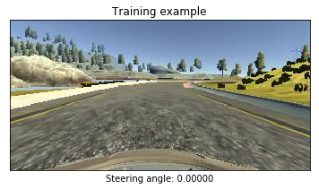
 <figcaption>
 

 
 </figcaption>
</figure>

---
## Step 1: Data Preprocessing

### Preprocessing steps:
-  Cropping the image to cut off the sky scene and the car front.
-  Resizing the image to (66 * 200), the image size that the model expects.
-  Converting the image to the YUV color space.
-  Normalizing the images (by dividing image data by 127.5 and subtracting 1.0). As stated in the Model Architecture section, this is to avoid saturation and make gradients work better).

<figure>
 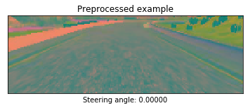
 <figcaption>
 

 
 </figcaption>
</figure>

---
## Step 2: Data Augmentation

### Augmentation steps:
-  Adjusting the steering angle of random images.
-  Flipping random images horizontaly, with steering angle adjustment.
-  Shifting (Translating) random images, with steering angle adjustment.
-  Adding shadows to random images.
-  Altering the brightness of random images.

**Image flipping**:
<figure>
 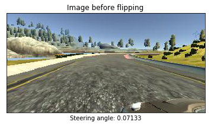
 <figcaption>
 

 
 </figcaption>
</figure>

<figure>
 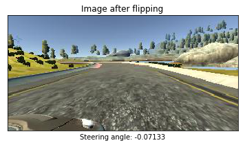
 <figcaption>
 

 
 </figcaption>
</figure>

**Image translation**:
<figure>
 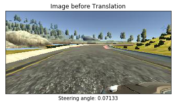
 <figcaption>
 

 
 </figcaption>
</figure>

<figure>
 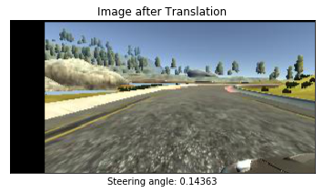
 <figcaption>
 

 
 </figcaption>
</figure>

**Image shadow**:
<figure>
 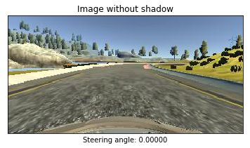
 <figcaption>
 

 
 </figcaption>
</figure>

<figure>
 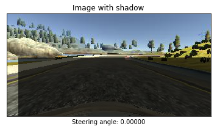
 <figcaption>
 

 
 </figcaption>
</figure>

**Image brightness**:
<figure>
 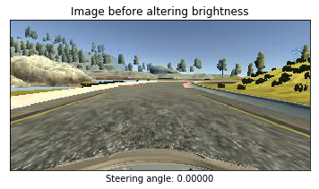
 <figcaption>
 

 
 </figcaption>
</figure>

<figure>
 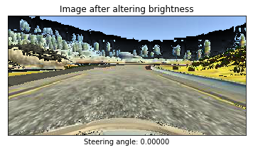
 <figcaption>
 

 
 </figcaption>
</figure>

**Image augmentation**:
<figure>
 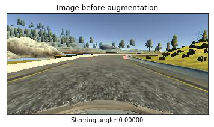
 <figcaption>
 

 
 </figcaption>
</figure>

<figure>
 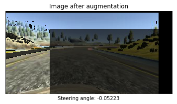
 <figcaption>
 

 
 </figcaption>
</figure>

---
## Step 3: Model Architecture

In this step, we will design and implement a deep learning model that can clone the vehicle's behavior.
We'll use a convolutional neural network (CNN) to map raw pixels from a single front-facing camera directly to steering commands.

We'll use the ConvNet from NVIDIA's paper [End to End Learning for Self-Driving Cars](https://arxiv.org/pdf/1604.07316v1.pdf), which has been proven to work in this problem domain.

<figure>
 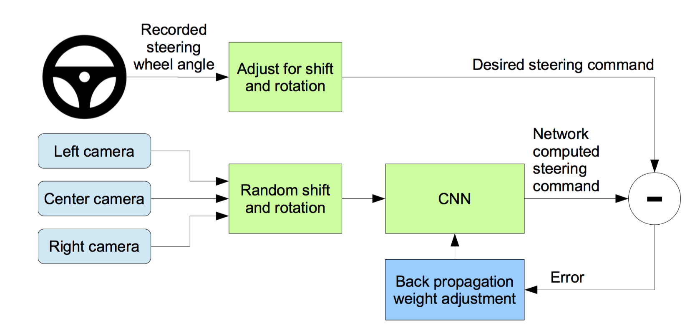
 <figcaption>
 

 </figcaption>
</figure>

According to the paper: *"We train the weights of our network to minimize the mean squared error between the steering command output by the network and the command of either the human driver, or the adjusted steering command for off-center and rotated images. Our network architecture is shown in Figure 4. The network consists of 9 layers, including a normalization layer, 5 convolutional layers and 3 fully connected layers. The input image is split into YUV planes and passed to the network.
The first layer of the network performs image normalization. The normalizer is hard-coded and is not adjusted in the learning process. Performing normalization in the network allows the normalization scheme to be altered with the network architecture and to be accelerated via GPU processing.
The convolutional layers were designed to perform feature extraction and were chosen empirically through a series of experiments that varied layer configurations. We use strided convolutions in the first three convolutional layers with a 2×2 stride and a 5×5 kernel and a non-strided convolution with a 3×3 kernel size in the last two convolutional layers.
We follow the five convolutional layers with three fully connected layers leading to an output control value which is the inverse turning radius. The fully connected layers are designed to function as a controller for steering, but we note that by training the system end-to-end, it is not possible to make a clean break between which parts of the network function primarily as feature extractor and which serve as controller."*

<figure>
 
 <figcaption>
 

 </figcaption>
</figure>

I've added a dropout layer to the model to prevent overfitting.

---
## Step 4: Model Training and Evaluation

-  I've splitted the data into 80% training set and 20% validation set to measure the performance after each epoch.
-  I used Mean Squared Error (MSE) as a loss function to measure how close the model predicts to the given steering angle for each input frame.
-  I used the Adaptive Moment Estimation (Adam) Algorithm minimize to the loss function. Adam is an optimization algorithm introduced by D. Kingma and J. Lei Ba in a 2015 paper named [Adam: A Method for Stochastic Optimization](https://arxiv.org/abs/1412.6980). Adam algorithm computes adaptive learning rates for each parameter. In addition to storing an exponentially decaying average of past squared gradients like [Adadelta](https://arxiv.org/pdf/1212.5701.pdf) and [RMSprop](https://www.cs.toronto.edu/~tijmen/csc321/slides/lecture_slides_lec6.pdf) algorithms, Adam also keeps an exponentially decaying average of past gradients mtmt, similar to [momentum algorithm](http://www.sciencedirect.com/science/article/pii/S0893608098001166?via%3Dihub), which in turn produce better results.
-  I used `ModelCheckpoint` from Keras to check the validation loss after each epoch and save the model only if the validation loss reduced.

### Model Training:

| Layer (type)                   |Output Shape      |Params  |Connected to     |
|--------------------------------|------------------|-------:|-----------------|
|lambda_1 (Lambda)               |(None, 66, 200, 3)|0       |lambda_input_1   |
|convolution2d_1 (Convolution2D) |(None, 31, 98, 24)|1824    |lambda_1         |
|convolution2d_2 (Convolution2D) |(None, 14, 47, 36)|21636   |convolution2d_1  |
|convolution2d_3 (Convolution2D) |(None, 5, 22, 48) |43248   |convolution2d_2  |
|convolution2d_4 (Convolution2D) |(None, 3, 20, 64) |27712   |convolution2d_3  |
|convolution2d_5 (Convolution2D) |(None, 1, 18, 64) |36928   |convolution2d_4  |
|dropout_1 (Dropout)             |(None, 1, 18, 64) |0       |convolution2d_5  |
|flatten_1 (Flatten)             |(None, 1152)      |0       |dropout_1        |
|dense_1 (Dense)                 |(None, 100)       |115300  |flatten_1        |
|dense_2 (Dense)                 |(None, 50)        |5050    |dense_1          |
|dense_3 (Dense)                 |(None, 10)        |510     |dense_2          |
|dense_4 (Dense)                 |(None, 1)         |11      |dense_3          |
|                                |**Total params**  |252,219 |                 |

## Model Evaluation:

| Epoch         |Loss       |Validation Loss  |
|---------------|-----------|-----------------|
|1/10           |0.0266     |0.0112           |
|2/10           |0.0212     |0.0106           |
|3/10           |0.0183     |0.0102           |
|4/10           |0.0170     |0.0085           |
|5/10           |0.0165     |0.0085           |
|6/10           |0.0159     |0.0120           |
|7/10           |0.0155     |0.0093           |
|8/10           |0.0156     |0.0102           |
|9/10           |0.0150     |0.0090           |
|10/10          |0.0145     |0.0093           |

---
## Step 5: Model Testing on the simulator:
The model was able to drive the car safely through the track without leaving the drivable portion of the track surface.

### First Track:
[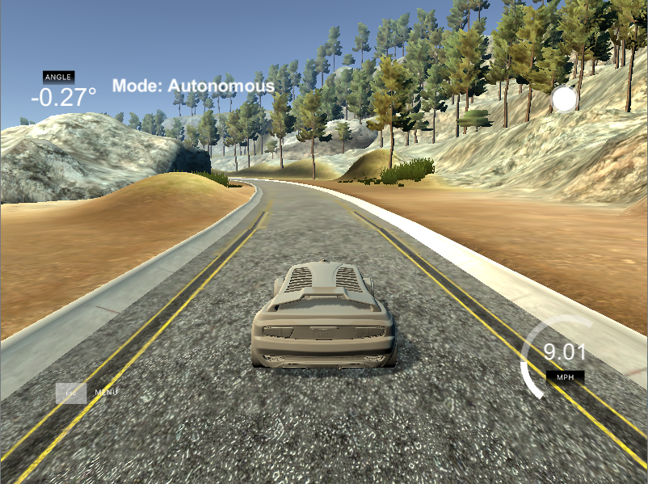](https://youtu.be/EWvqiYJnKfY)

**[YouTube Link](https://youtu.be/EWvqiYJnKfY)**

---
## Conclusion

Using NVIDIA's End to End learning network, the model was able to drive the car through the first track. I've only used the training data provided by Udacity.
One way to improve the model is to collect more data from the mountain track, and train the model to go through this challenging track as well.
We can also modify `drive.py` script to change the maximum speed and make it related to the steering angle, in order to make the car speed up in the straight parts of the track, and slow down in the curved parts.
